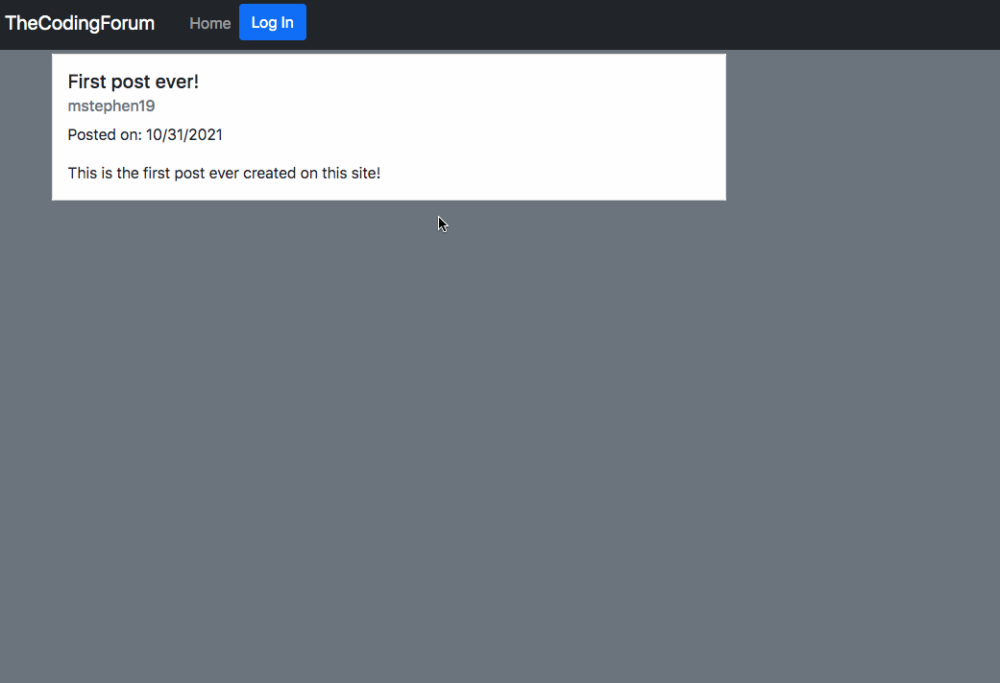

# TheCodingForum [Link](https://wicked-eyeballs-56621.herokuapp.com/)

This is a blog website in which the user is able to view posts from other users. Once they create an account, they have access to commenting on others' posts, as well as their own personal dashboard on which they can create a new post, as well as view, edit, or delete any of their existing posts.

## Built With

- [Javascript](https://developer.mozilla.org/en-US/docs/Web/JavaScript)
- [Node.js](https://nodejs.org/en/)
- [MySQL](https://www.mysql.com/)
- [Express.js](https://expressjs.com/)
- [Sequelize.js](https://sequelize.org/)
- [Bcrypt](https://www.npmjs.com/package/bcrypt)
- [Handlebars.js](https://handlebarsjs.com/)
- [Connect Session Sequelize](https://www.npmjs.com/package/connect-session-sequelize)
- [Express Session](https://www.npmjs.com/package/express-session)

## Deployed Link

- [Live Site Here](https://wicked-eyeballs-56621.herokuapp.com/)

## Author

**Matt Stephens**

- [Link to Portfolio Site](https://mstephen19.github.io/newestPortfolio)
- [Link to Github](https://github.com/mstephen19)
- [Link to LinkedIn](https://www.linkedin.com/mstephen19)

## License

This project is licensed under the MIT License

## Acknowledgments

- Shoutout to [Jerome Chenette](https://www.linkedin.com/in/jeromechenette/) for being such an incredible instructor
